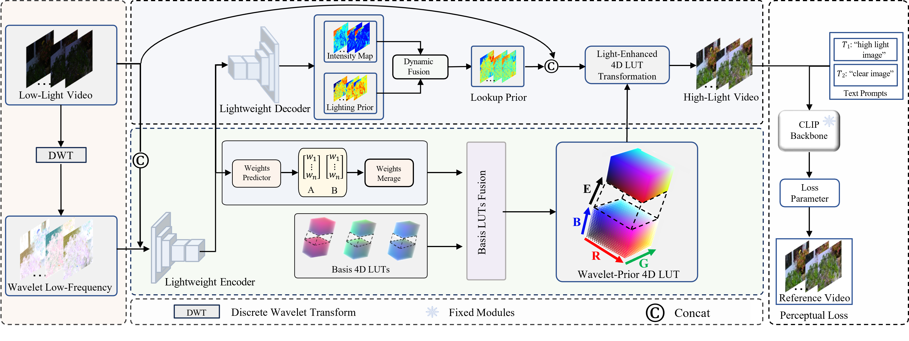

# Optimizing 4D Lookup Table for Low-light Video Enhancement via Wavelet Priori.[[WaveLUT]]()
## Introduction
<p align="center">
  
</p>

WaveLUT optimizes the 4D lookup table (LUT) technique by wavelet prior, which effectively improves the accuracy of color mapping while maintaining the efficiency. Meanwhile, we explore a dynamic fusion strategy to effectively fuse different a priori knowledge. And we utilize multimodal semantics combined with Fourier frequency domain for perception-oriented appearance driving. Experimental results on benchmark datasets show that our approach reaches the state-of-the-art.
## Installation
### Environment
```
conda activate WaveLUT
pip install -r requirements
python models/WaveLUT/transformation/setup.py install
```
## Datasets Download
SDSD and SMID datasets [Wang](https://github.com/dvlab-research/SDSD). DID datasets [Fu](https://github.com/ciki000/DID)

### Pre-Trained Models
download this [model]() and put it into `WaveLUT/ckpt/`.

### Quick Start


```
python evaluation.py -opt [YOUR_yml]
```

## TODO
- [x] Pre-Trained Models
- [x] Test
- [ ] Train
## Citation
```

```
